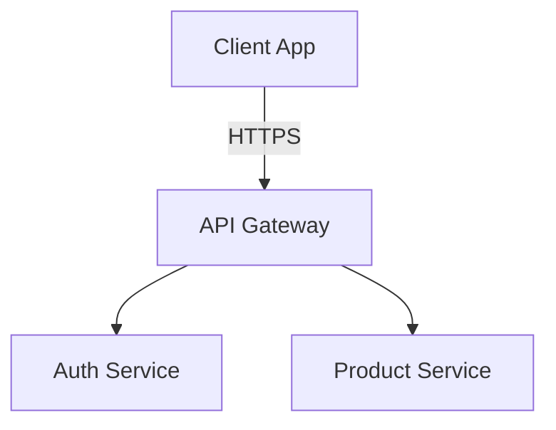

# 🚀 English Vocabulary Learning System

Đây là một dự án cá nhân được xây dựng nhằm hỗ trợ việc học từ vựng tiếng Anh theo phương pháp phù hợp với bản thân. 

Thông qua quá trình phát triển dự án, không chỉ nâng cao vốn từ vựng tiếng Anh mà còn rèn luyện và cải thiện kỹ năng lập trình web, đồng thời tạo ra một nền tảng học tập trực tuyến phục vụ cho nhu cầu học tập của chính mình.
---

## 📌 Mục lục
1. [Tính năng nổi bật](#-tính-năng-nổi-bật)
2. [Kiến trúc hệ thống](#-kiến-trúc-hệ-thống)
3. [Công nghệ sử dụng](#-công-nghệ-sử-dụng)
4. [Yêu cầu hệ thống](#-yêu-cầu-hệ-thống)
5. [Hướng dẫn cài đặt nhanh](#-hướng-dẫn-cài-đặt-nhanh)
6. [Hướng dẫn sử dụng & Kiểm thử](#-hướng-dẫn-sử-dụng--kiểm-thử)
7. [Tài liệu liên quan](#-tài-liệu-liên-quan)
8. [Quy định đóng góp (Contributing)](#-quy-định-đóng-góp-contributing)
9. [Tác giả & Bản quyền](#-tác-giả--bản-quyền)

---

## ✨ Tính năng nổi bật
Với cách học là cho ngẫu nhiên cách từ tiếng Anh, trang web cho ra những tính năng nổi bật:
* **Tính năng 1**: Trộn ngẫu nhiên các từ tiếng Anh

---

## 📐 Kiến trúc hệ thống
> [!NOTE]
> Dự án sử dụng mô hình Clean Architecture để tách biệt Business Logic và Giao diện.

*(Chèn sơ đồ kiến trúc dạng ảnh hoặc dùng chuỗi Mermaid tại đây)*

---

## 📚 Tài liệu liên quan

[1] 3000 từ Tiếng Anh thông dụng, https://english4u.com.vn/Uploads/files/3000.pdf

[2] Tài liệu Javascript, https://www.w3schools.com/js/

[3] Tài liệu CSS, https://www.w3schools.com/css/

[4] Tài liệu HTML, https://www.w3schools.com/html/

[5] Tài liệu Python, https://www.w3schools.com/python/

---

## 👨‍💻 Tác giả & Bản quyền

Siu San

Sinh viên nghành Công nghệ thông tin

Chuyên ngành Trí tuệ nhân tạo

Trường Đại học Quy Nhơn

Mã sinh viên: **4651050224**

email: siusan2005@gmail.com

phone: 0946171903

---

